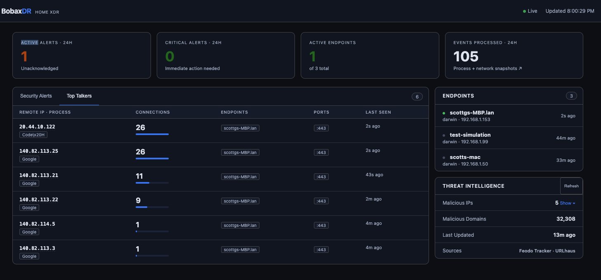

# BobaxDR — Home XDR

A home-use Extended Detection and Response (XDR) system. Monitors endpoint processes and network connections across your home network, detects threats in real time, and presents findings in a live security dashboard.

Built for Spectrum internet. Inspired by Palo Alto Cortex XDR.



---

## Architecture

```
bobaxdr/
├── server/                  # Central server (run on always-on Mac)
│   ├── main.py              # FastAPI app, event ingestion, REST API
│   ├── database.py          # SQLite via SQLAlchemy
│   ├── models.py            # Endpoint, Event, Alert models
│   ├── detection/
│   │   ├── engine.py        # Detection rule engine
│   │   └── threat_intel.py  # Live threat feed downloader
│   └── static/
│       └── index.html       # Dark-mode dashboard UI
├── agent/                   # Endpoint agent (runs on every device)
│   ├── agent.py             # Main loop — collects and reports data
│   ├── process_monitor.py   # Running processes via psutil
│   └── network_monitor.py   # Active connections per process
├── sensor/
│   └── sensor.py            # Network sensor (packet capture or fallback)
├── install.sh               # Dependency installer
├── start.sh                 # Start server + local agent together
├── requirements-server.txt
├── requirements-agent.txt
└── requirements-sensor.txt
```

---

## Quick Start

### 1. Install

```bash
bash install.sh
```

### 2. Start the server + local agent

```bash
bash start.sh
```

On first run an API key is generated and printed. The dashboard opens at **http://localhost:8000**.

### 3. Add more devices

Copy the API key printed on first server start (also saved to `.api_key` in the project root), then follow the steps for each platform below.

---

## Installing the Agent

The agent runs on macOS, Windows, and Linux. It reports running processes and active network connections to the server every 10–30 seconds.

### macOS

```bash
# Copy the three agent files to the target machine
scp agent/agent.py agent/process_monitor.py agent/network_monitor.py \
    user@<target-ip>:~/bobaxdr-agent/

# On the target Mac
cd ~/bobaxdr-agent
/Library/Frameworks/Python.framework/Versions/3.12/bin/pip3 install psutil requests
export BOBAXDR_API_KEY=<key>
export BOBAXDR_SERVER=http://<server-ip>:8000
/Library/Frameworks/Python.framework/Versions/3.12/bin/python3 agent.py
```

> Use the full Python 3.12 path — the Xcode-bundled Python 3.9 at `/usr/bin/python3` will not work correctly.

### Linux (Kali, Ubuntu, Debian)

Modern Debian-based distros block system-wide pip installs. Use a virtualenv:

```bash
# Copy agent files
scp agent/agent.py agent/process_monitor.py agent/network_monitor.py \
    user@<target-ip>:~/bobaxdr-agent/

# On the target Linux machine
cd ~/bobaxdr-agent
python3 -m venv venv
source venv/bin/activate
pip install psutil requests

export BOBAXDR_API_KEY=<key>
export BOBAXDR_SERVER=http://<server-ip>:8000
python3 agent.py
```

To keep the venv active across sessions, add `source ~/bobaxdr-agent/venv/bin/activate` to `~/.bashrc`.

### Windows

```powershell
# Copy agent files to C:\bobaxdr-agent\ then open PowerShell as Administrator
cd C:\bobaxdr-agent
pip install psutil requests

$env:BOBAXDR_API_KEY = "<key>"
$env:BOBAXDR_SERVER  = "http://<server-ip>:8000"
python agent.py
```

For best visibility on Windows, run as Administrator — this allows psutil to see connections from all processes, not just the current user.

### Verify the agent connected

After starting the agent, check the **Endpoints** panel in the dashboard. The device should appear as online within 30 seconds. You can also check from the server machine:

```bash
curl -s -H "x-api-key: $(cat .api_key)" http://localhost:8000/api/endpoints
```

### Environment variables

| Variable | Default | Description |
|---|---|---|
| `BOBAXDR_API_KEY` | *(required)* | Key printed on first server start, saved to `.api_key` |
| `BOBAXDR_SERVER` | `http://localhost:8000` | URL of the BobaxDR server |
| `BOBAXDR_PROC_INTERVAL` | `30` | Seconds between process snapshots |
| `BOBAXDR_NET_INTERVAL` | `10` | Seconds between network connection snapshots |

---

### 4. Enable full network sensor (optional, requires sudo)

For DNS query monitoring and inbound port scan detection via packet capture:

```bash
sudo BOBAXDR_API_KEY=$BOBAXDR_API_KEY \
     BOBAXDR_SERVER=$BOBAXDR_SERVER \
     python3 sensor/sensor.py
```

Without sudo the sensor falls back to connection-level monitoring and still does DNS hijack detection.

---

## Dashboard

The web dashboard at **http://localhost:8000** shows:

- **Active alerts** with severity badges (Critical / High / Medium / Low)
- **Endpoint status** — online/offline, platform, IP, last seen
- **Threat intelligence status** — how many malicious IPs and domains are loaded
- Filter alerts by severity; acknowledge and clear resolved findings
- Auto-refreshes every 15 seconds

---

## Detection Rules

| Rule | Severity | How it fires |
|---|---|---|
| `CRYPTO_MINER` | Critical | Process name matches xmrig, cgminer, lolminer, and 20+ known miners |
| `CRYPTO_MINER_HEURISTIC` | High | Process using >85% CPU while connected to a mining pool port |
| `MALICIOUS_IP_CONNECTION` | Critical | Outbound connection to a Feodo Tracker C2 IP |
| `MALICIOUS_DOMAIN_DNS` | High | DNS query for a domain in the URLhaus blocklist |
| `C2_BEACONING` | High | Process connecting to the same external IP at statistically regular intervals |
| `PORT_SCAN_INBOUND` | High | 10+ TCP SYN packets from the same external IP to different ports within 60s |
| `PORT_SCAN_OUTBOUND` | Medium | A single process hitting 20+ unique external targets in one reporting interval |
| `DNS_TUNNELING` | Medium | DNS query sent to a non-standard port (not 53 / 853 / 5353) |
| `SUSPICIOUS_DNS_SERVER` | Medium | DNS routed to an unrecognized external server (not Spectrum 75.75.75.75/76, Google, Cloudflare, etc.) |
| `SUSPICIOUS_PROCESS_PATH` | High | Executable running from /tmp, Downloads, AppData Temp, or /dev/shm |

Alerts are deduplicated — the same rule + indicator on the same endpoint won't re-fire within 10 minutes.

---

## Threat Intelligence

Feeds are downloaded on startup and refreshed every 4 hours:

| Feed | Source | Content |
|---|---|---|
| Feodo Tracker | abuse.ch | Known botnet C2 IP addresses |
| URLhaus | abuse.ch | Malicious domains and URLs |

The sensor also maintains a DNS baseline at startup and alerts if a known domain starts resolving to an unexpected IP range (DNS hijack detection).

### What the Feodo C2 IPs actually are

The IPs in the Feodo blocklist are confirmed **botnet command-and-control servers** — machines that infected computers phone home to for instructions. They appear in the dashboard's Threat Intelligence panel as the watchlist. They are **not on your network**; BobaxDR watches for any local device that tries to connect to one and fires a Critical alert if it does.

The blocklist is dominated by two malware families:

**Emotet** — one of the most destructive banking trojans on record. Spreads via malicious email attachments, steals credentials, and is frequently used to drop ransomware. Was largely dismantled by a coordinated law enforcement takedown in 2021 but has resurfaced in waves since.

**QakBot** (QBot / Quakbot) — a banking trojan that steals credentials and browser data and acts as a loader for ransomware (notably Black Basta). The FBI disrupted its infrastructure in August 2023 ("Operation Duck Hunt"), but operators rebuilt and it remains active. QakBot C2s commonly run on port 443 to blend in with normal HTTPS traffic, hosted on cloud providers like AWS and DigitalOcean to avoid IP-based blocking.

The typical C2 hosting pattern — rented VPS nodes on AWS, DigitalOcean, or Sakura Internet, no reverse DNS (PTR) record set — is intentional. Legitimate services almost always configure PTR records; the absence of one on a server receiving regular connections is a red flag. Operators rent these servers cheaply, use them briefly, and abandon them when they get blocked, which is why the Feodo list contains a mix of `online` and `offline` entries.

---

## Configuration

All settings are via environment variables:

### Server

| Variable | Default | Description |
|---|---|---|
| `BOBAXDR_DB` | `bobaxdr.db` | Path to the SQLite database |

### Agent

| Variable | Default | Description |
|---|---|---|
| `BOBAXDR_SERVER` | `http://localhost:8000` | Server URL |
| `BOBAXDR_API_KEY` | *(required)* | API key from server startup |
| `BOBAXDR_PROC_INTERVAL` | `30` | Seconds between process snapshots |
| `BOBAXDR_NET_INTERVAL` | `10` | Seconds between network connection snapshots |

The API key is auto-generated on first server start and saved to `.api_key` in the project root.

---

## Requirements

**Python 3.10+** on all components.

On macOS, use the full python.org Python 3.12 install rather than the Xcode bundled Python:
```bash
/Library/Frameworks/Python.framework/Versions/3.12/bin/python3
```

**Server:** `fastapi uvicorn sqlalchemy aiohttp certifi`  
**Agent:** `psutil requests`  
**Sensor:** `scapy psutil requests dnspython` (scapy optional — fallback runs without it)

---

## How to Block an IP (macOS)

If BobaxDR fires a **Critical** alert for a `MALICIOUS_IP_CONNECTION` and you've confirmed it's not a false positive, block the IP using macOS's built-in `pf` packet filter.

### Temporary block (until reboot)

```bash
echo "block drop quick from any to <IP>" | sudo pfctl -ef -
```

### Permanent block

1. Open `/etc/pf.conf` in a text editor (requires sudo):

```bash
sudo nano /etc/pf.conf
```

2. Add this line near the top, after any existing `block` rules:

```
block drop quick from any to <IP>
```

3. Reload the ruleset:

```bash
sudo pfctl -f /etc/pf.conf
sudo pfctl -e   # enable pf if it isn't already running
```

4. Verify the rule is active:

```bash
sudo pfctl -sr | grep <IP>
```

### Block multiple IPs with a table (cleaner for a list)

```bash
# Create a persistent blocklist file
sudo nano /etc/pf-blocklist.conf
```

Add one IP per line:
```
1.2.3.4
5.6.7.8
```

Then in `/etc/pf.conf`, add:
```
table <blocklist> persist file "/etc/pf-blocklist.conf"
block drop quick from any to <blocklist>
block drop quick from <blocklist> to any
```

Reload with `sudo pfctl -f /etc/pf.conf`. To add new IPs later without a full reload:
```bash
sudo pfctl -t blocklist -T add <IP>
```

### Before you block

Check whether the alert is a false positive first:
- Click the IP in the **Top Talkers** tab to resolve it — legitimate services (Microsoft, Google, Apple, GitHub) almost always have a PTR record
- Check which process is making the connection in the **Events Processed** modal
- Well-known vendor clouds (Azure `20.x`, AWS `34.x`/`52.x`, Google `142.250.x`) are usually benign even without a PTR record

Real indicators worth blocking: unknown process + no PTR record + IP in Feodo/URLhaus blocklist + port 4444/8080/9001.
